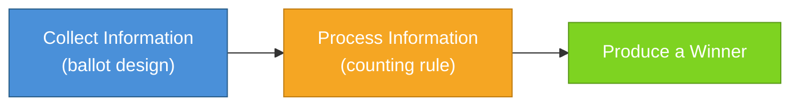

# Introduction

## Voting and Collective Decision-Making

---

## What Problem Does Voting Solve?

Whenever a group must make a decision -- and its members disagree -- a procedure is required.

- A city must choose a mayor.
- A legislature must fill a vacant seat.
- A community must select a board member.
- A nation must choose a president.

In each case, many individuals have preferences. But only one outcome can occur.

The central problem is this:

> How can a group translate many individual preferences into one collective decision?

Voting is one family of solutions to that problem.

It is not the only one. Consensus, delegation, appointment, and random selection have all been used in different contexts. But voting is among the most widely adopted mechanisms for resolving disagreement in modern democracies.

Understanding voting systems requires understanding what they are designed to do.

---

## From Assemblies to Elections

In small groups, decision-making can be direct.

In ancient assemblies, citizens gathered in one place and voted by show of hands or voice. When the group is small and visible, counting can be immediate. Debate and voting occur in the same physical space.

But scale changes design.

As populations grow:

- Gathering everyone in one place becomes impractical.
- Votes must be recorded rather than observed.
- Ballots must be counted reliably.
- Results must be accepted as legitimate.

Over time, representative systems emerged. Instead of voting on every issue directly, citizens elect individuals to make decisions on their behalf.

This shift -- from direct decision to selecting decision-makers -- creates a new design challenge:

> How should we choose among multiple candidates competing for a single office?

The answer is not self-evident. Different societies have adopted different rules.

Those rules shape outcomes.

---

## What Voting Systems Actually Do

At a basic level, a voting system performs three functions:

1. **Collect information** from voters (a single choice, a ranking, approvals, ratings)
2. **Process that information** according to a counting rule (tallying, elimination rounds, pairwise comparison)
3. **Produce a winner**

Each of these stages involves design decisions.

- Should voters choose only one candidate?
- Should they rank all candidates?
- Should they indicate which are acceptable?
- Should the winner require a majority?
- Should counting occur in one round or multiple?
- Should the winner be the candidate with the most support? The broadest support? The least opposition?

There is no procedure that optimizes for every possible value at once.

Some systems prioritize simplicity. Some prioritize majority support. Some prioritize expressive ballots. Some attempt to reduce vote splitting.

Every system balances tradeoffs.

This series examines those tradeoffs.

Along the way, we will encounter three recurring concepts that are worth naming up front.

**Strategic voting** occurs when a voter casts a ballot that does not reflect their genuine preferences because they believe a different ballot will produce a better outcome for them. This is rational behavior within a system's constraints -- not cheating and not a failure of the voter. Different systems create different strategic pressures, and some make honest expression a stronger strategy than others.

**Pathologies** are systematic outcomes that no reasonable design would intentionally produce -- results that undermine the purpose of holding an election. Vote splitting, where similar candidates cannibalize each other's support and a less-preferred candidate wins as a result, is one example. Pathologies are distinct from **tradeoffs**, which are consequences that follow from a deliberate design prioritization. A tradeoff may be acceptable depending on what one values; a pathology is not.

**Honesty incentives** describe the degree to which a voting system rewards voters for expressing their genuine preferences. In some systems, honest expression is frequently the best strategy. In others, voters face strong pressure to misrepresent their preferences in order to achieve a better outcome. How much a system rewards honesty is one of the most practical questions a voter or reformer can ask.

Each of these concepts will be examined in detail as they arise in specific voting systems.

---

## Three Contexts for Voting

Voting is used in several distinct contexts:

1. **Single-winner elections** -- One seat is filled. (Mayor, Governor, President.)
2. **Multi-winner elections** -- Multiple seats are filled at once. (City councils, legislatures, boards.)
3. **Referendums and ballot measures** -- Voters choose among policy options rather than candidates. (Bond measures, ballot propositions.)

Each context presents different design questions.

This series focuses on the first category:

> Single-winner elections used to fill a single office.

These elections present a particularly interesting challenge when more than two candidates compete. Questions about majority support, vote splitting, elimination order, and preference expression arise most clearly in this setting.

Multi-winner systems introduce additional structural questions -- such as proportional representation and minority inclusion -- which will be addressed separately.

Referendums operate under a different logic, typically involving binary choices. They raise distinct issues and will not be the focus here.

---

## A Note on Scope

This series does not attempt to promote a particular reform.

Instead, it seeks to build structural literacy.

For each voting system we examine, we will ask:

- What problem is it attempting to solve?
- What information does it collect?
- How does it process that information?
- What tradeoffs does it introduce?
- What outcomes does it guarantee -- and what does it not?

The goal is not to declare one system "best."

It is to understand what each system is designed to prioritize.

Only after understanding those design choices can meaningful evaluation occur.

---

## Where We Begin

We will begin with the most widely used method in the United States and many other countries:

**Plurality voting.**

Plurality is often treated as the default.

But it, too, is a design choice -- one that emerged under particular historical and administrative conditions.

Understanding why plurality became dominant -- and what it optimizes for -- provides the foundation for evaluating every alternative that follows.

From there, we will examine other single-winner systems that attempt to address its structural consequences.

Each new method will emerge as a response to limitations in the previous one.

And each will introduce tradeoffs of its own.
